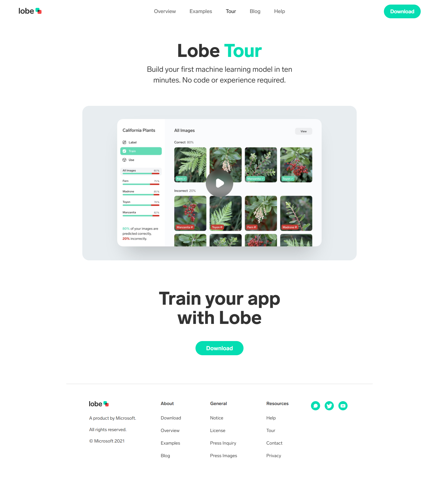

# 🧠 Lobe Website (Frontend Practice)

This project is a **frontend recreation of [Lobe](https://www.lobe.ai/)** — a Microsoft product website.  
It was built purely for **practice and educational purposes**, focusing on responsive layout, smooth UI design, and component organization using **React**, **Tailwind CSS**, and **Lucide Icons**.

---

## 🎨 Preview




---

## ⚙️ Tech Stack

| Tool / Library  | Purpose |
| ---------------- | -------- |
| **React (Vite)** | Frontend framework for building components |
| **Tailwind CSS** | Styling and responsive layout |
| **Lucide Icons** | Icon library for navigation and UI elements |

---

## 📁 Folder Structure

```bash
src/
├── assets/
│   └── images/         # Logo and visuals
├── components/
│   ├── Header.jsx      # Navbar component
│   ├── Hero.jsx        # Main hero section
│   └── Footer.jsx      # Footer component
├── App.jsx
└── main.jsx
```

---

## 👨‍💻 Created by
**Emmanuel Toribio**<br>
🌐 [GitHub Profile](https://github.com/emmant-web)
